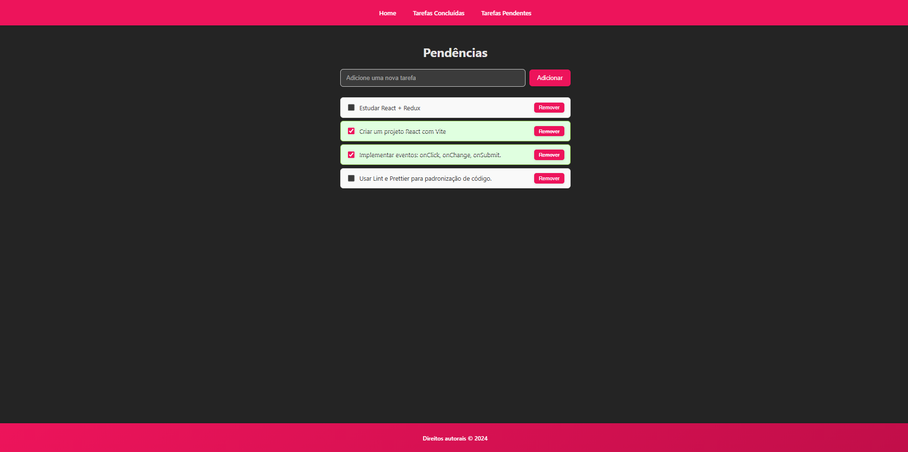

# ✅ React List App (TypeScript)

Aplicação simples de **lista de tarefas (to-do list)** desenvolvida em **React + TypeScript**, com gerenciamento de estado via **useReducer** e integração com **API (Axios)**.  
O objetivo é demonstrar boas práticas no uso de **Hooks**, organização de componentes e consumo de APIs em aplicações React.

---



---

## 🚀 Como rodar o projeto

### 1. Clone o repositório

```bash
git clone https://github.com/LuanMarquesDev/react-list-app-ts.git
```

### 2. Acesse a pasta

```bash
cd react-list-app-ts
```

### 3. Instale as dependências

```bash
npm install
# ou
yarn install
```

### 4. Inicie o servidor de desenvolvimento

```bash
npm run dev
# ou
yarn dev
```

Agora acesse no navegador:
👉 `http://localhost:5173`

---

## 🛠️ Tecnologias utilizadas

- ⚛️ [React](https://reactjs.org/) – Biblioteca para interfaces
- ⌨️ [TypeScript](https://www.typescriptlang.org/) – Tipagem estática
- 🎨 [Styled Components](https://styled-components.com/) – Estilização
- 🔄 [React Hooks (useReducer, useEffect, useState)](https://react.dev/reference/react) – Gerenciamento de estado
- 🚦 [React Router](https://reactrouter.com/) – Navegação e rotas SPA
- 🌐 [Axios](https://axios-http.com/) – Requisições HTTP
- 📦 [Vite](https://vitejs.dev/) – Build tool para projetos React

---

## 📂 Estrutura de pastas (simplificada)

```
react-list-app-ts/
├── src/
│   ├── components/       # Componentes reutilizáveis (Header, Footer, etc.)
│   ├── pages/            # Páginas principais (AddTask, TaskList)
│   ├── reducers/         # Reducers para useReducer
│   ├── types/            # Tipagens TypeScript
│   ├── App.tsx           # Componente raiz
│   └── main.tsx          # Entrada da aplicação
```

---

## 📌 Funcionalidades

- ➕ Adicionar uma tarefa
- ❌ Remover uma tarefa
- ✅ Marcar/desmarcar como concluída
- 🔄 Persistência de dados via API (Axios)

---

## 📜 Licença

Este projeto está sob a licença MIT.
Sinta-se livre para usar e modificar como quiser.

---

Feito com 💙 por [Luan Marques](https://github.com/LuanMarquesDev) 🚀

```

```
